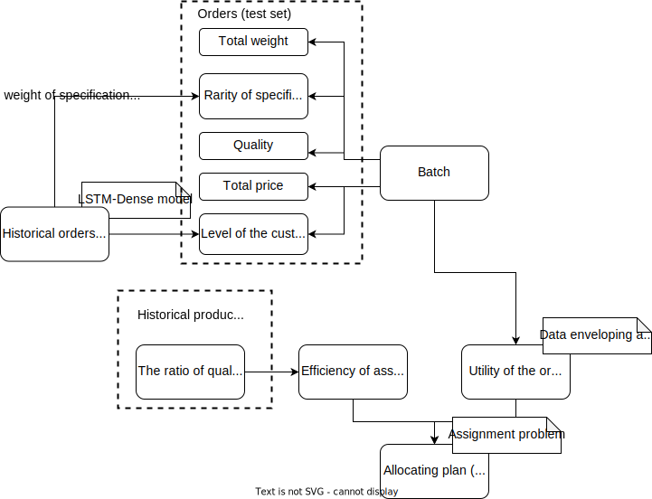
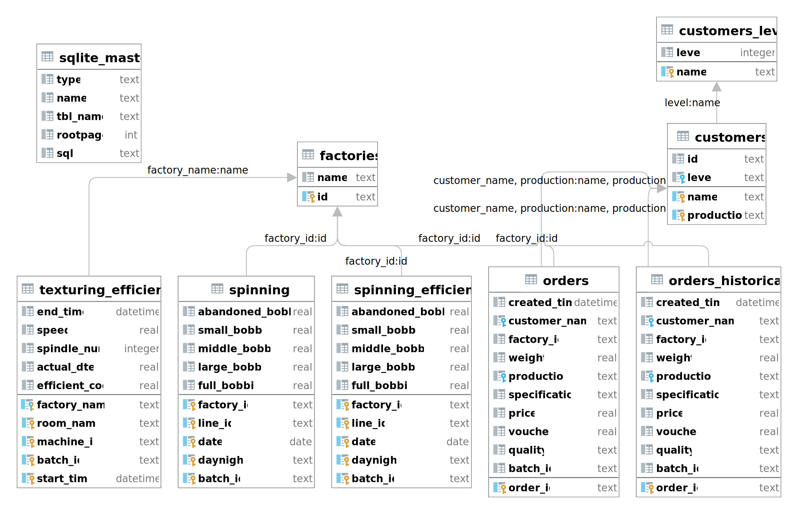

# Textile production planning

Production planning of textile orders: evaluating, allocating, and scheduling

## Introduction

This project provides an example of textile enterprise, H company, to explain how to evaluate orders, allocate them to factories (managed by the enterprise), and provides the schedule or production plan for each factory.

The framework is shown as follow.

We combine the orders to "batches". Each batch is derived by multiple orders, with different customers, weight, price but the same production and specification. The orders are combined with the following rule:

- Most recent created time

- Sum of weight, Sum of price weighted by the weight

- Mean of quality weighted by the weight

In the first step, we evaluate the utility of batches based on the total weight, total price, whether the specification is common, textile's quality, and the quality of customer [^fn1].

[^fn1]: The quality of the customer is assessed based on his historical orders by external model.

In the second step, we evaluate the efficient of each factory to produce each production based on historical records. With the utility of batches and the efficient, we allocate the batches to different factories.

In the third step, we schedule the batches in each factory, to reach the optimal workload for each machine and each day. The aim is to improve the efficiency and reduce the number of overdue bathes.

## Database

The database is driven by SQLite3. The diagram of the database is shown as following.

**customers_level**

Convert the quality of the customer from the Chinese alias (defined by H company) to an ordinal variable. Level 1 is the worst customers and 5 is the best customers.

| Name  | Type    | Description                                                                           |
| ----- | ------- | ------------------------------------------------------------------------------------- |
| name  | text    | Chinese alias of the quality of the customer, defined by H company                    |
| level | integer | Ordinal variable, the quality of the customer, where 1 is the worst and 5 is the best |

**customers**

The quality of the customers, where the ordinal relationship of different customer levels is shown in table "customers_level".

| Name       | Type | Description                                                                                                                        |
| ---------- | ---- | ---------------------------------------------------------------------------------------------------------------------------------- |
| id         | text | customer's identifier                                                                                                              |
| name       | text | customer's company name                                                                                                            |
| production | text | the production that the customer buys; one company can have multiple levels if it buys multiple kinds of production from H company |
| level      | text | Chinese alias of the quality of the customer, defined by H company                                                                 |

**factories**

The factories managed by H company.

| Name | Type | Description          |
| ---- | ---- | -------------------- |
| id   | text | Factory's identifier |
| name | text | Factory's name       |

**orders** and **orders_historical**

The orders are created from 2020-10-12 to 2020-11-21, that is the period we analyze. The historical orders are created earlier than 2020-10-12. We use these orders to estimate the quantile of the price and weight, as the measurements of the analyzed order's utility.

| Name          | Type     | Description                                                                |
| ------------- | -------- | -------------------------------------------------------------------------- |
| order_id      | text     | The order's identifier                                                     |
| created_time  | datetime | When the order is received                                                 |
| customer_name | text     | The customer which sends the order                                         |
| factory_id    | text     | The factory which works on the order (ground truth of the allocating step) |
| weight        | real     | The weight of ordered textile                                              |
| production    | text     | The production type of ordered textile                                     |
| specification | text     | The specification of ordered textile                                       |
| price         | real     | The price of 1KG ordered production                                        |
| voucher       | real     | The discount amount of this order                                          |
| quality       | real     | The quality of ordered  textile                                            |
| batch_id      | text     | The batch's identifier                                                     |

**spinning** and **spinning_efficiency**

Spinning produces FDY and POY. They input melted polyester to the workshop, and the machines output FDY or POY. The "spinning" table is the production log corresponding to batches in "orders" table, which functions as the ground truth of evaluating and scheduling process in the analyzed period. The "spinning_efficiency" table is the production log earlier than 2020-10-12, which is used to estimate the efficient of assembly lines.

| Name             | Type | Description                                                                                                                                                                                   |
| ---------------- | ---- | --------------------------------------------------------------------------------------------------------------------------------------------------------------------------------------------- |
| factory_id       | text | The factory's identifier                                                                                                                                                                      |
| line_id          | text | The assembly line's identifier                                                                                                                                                                |
| date             | text | The date of the shift                                                                                                                                                                         |
| daynight         | text | Whether the shift is day or night ("白班" is day shift and "夜班" is night shift)                                                                                                                 |
| batch_id         | text | The batch's identifier                                                                                                                                                                        |
| abandoned_bobbin | real | The machine outputs fibers from melted polyester and wind the fibers on the bobbin. This attribute measures the amount of abandoned bobbins with fibers, where the unit of number is unknown. |
| small_bobbin     | real | The amount of bobbins with small amount of fibers                                                                                                                                             |
| middle_bobbin    | real | The amount of bobbins with middle amount of fibers                                                                                                                                            |
| large_bobbin     | real | The amount of bobbins with large amount of fibers                                                                                                                                             |
| full_bobbin      | real | The amount of full bobbins, where the amount of fibers is as designed                                                                                                                         |

**texturing_efficiency**

Texturing produces DTY from the output of spinning. This table is the production log earlier than 2020-10-12, which is used to measure the efficiency of texturing assembly lines.

| Name           | Type     | Description                                                                                        |
| -------------- | -------- | -------------------------------------------------------------------------------------------------- |
| factory_name   | text     | The factory's name                                                                                 |
| room_name      | text     | The workshop's name                                                                                |
| machine_id     | text     | The machine's identifier                                                                           |
| batch_id       | text     | The batch's identifier                                                                             |
| start_time     | datetime | When the production log starts                                                                     |
| end_time       | datetime | When the production log ends                                                                       |
| speed          | real     | The producing speed of the machine. The unit of number is unknown.                                 |
| spindle_num    | integer  | The number of spindles in the machine                                                              |
| actual_dtex    | real     | 1dtex = 1 grams per 10,000 meters of yarn. This attribute records the actual "dtex" in this batch. |
| efficient_coef | real     | efficient coefficient                                                                              |

## Functions

The production log is not well-organized, so we only use FDY orders and production log  of spinning for analysis. The time period of 2020-10-12 to 2020-11-21 is "current" and the time period before 2020-10-12 is historical.

We aim to provide production plan for current period based on statistics of historical period.

### 1. Data pre-processing

**Orders**

H company tracks the production process by batch identifier, so we group the orders into batches. In this step, we input the current orders and historical orders, and expect the script to output batches and historical batches.

The script to retrieve current orders is `sql/batches_FDY.sql` and that to retrieve historical order is `sql/batches_hist_FDY.sql`.

We group orders into batches with the following rules:

- Sum of textile's weight

- Sum of total price, where for each order, total price is "weight * price - voucher"

- Scarcity of specification, represented by the sum of the specification's weight in historical orders

- Average of textile's quality, weighted by textile's weight. we convert each quality to an ordinal variable by the following table.

| Start with | AAA | AA  | A   | B   |
| ---------- | --- | --- | --- | --- |
| Value      | 4   | 3   | 2   | 1   |

The customer's level should be the same for orders in the same batch.

**Efficiency**

FDY textile involves in only spinning. We use historical production log of spinning to evaluate the efficiency of each assembly line. In this step, we input historical log of spinning and expect the script to output efficiency of each assembly line.

The efficiency of each shift is represented by "one minus the ratio of textile on abandoned bobbins over textile on all bobbins". The efficiency of each batch is that of the mean of all shifts producing textile in this batch.

The script to retrieve efficiency is `sql/spinning_efficiency_FDY.sql`.

### 2. Data enveloping analysis

With batches and efficiency, we aim to evaluate the batches. H company prefer to plan batches with higher utilities. We use data enveloping analysis to implement this step, which is a multi-input and multi-output operation method.

The script of this step is `1_utility_FDY.py`.

Following section 1, we retrieve 5 variables as the following table.

| Name                | Type | Description                                                                         |
| ------------------- | ---- | ----------------------------------------------------------------------------------- |
| batch_id            | text | The identifier of this batch.                                                       |
| total_weight        | real | The total weight of textile in this batch.                                          |
| total_price         | real | The total price of textile in this batch.                                           |
| total_weight_inhist | real | The weight of textile in historical batches which have the same specification.      |
| quality             | real | The mean of the quality of textile in this batch, weighted by the textile's weight. |
| customer_level      | real | The level of the customer who ordered textile in this batch.                        |

We construct a pipeline to perform data pre-processing.

1. For "total_weight" and "total_price", perform $x \to \ln x$.

2. For "total_weight_inhist", perform $x \to - \ln x$.

3. Denote $\bar x$ as the mean of each variable and $\sigma(x)$ as the standard deviation of each variable. For all variables, assign outliers which is smaller than $\bar x - 3 \sigma(x)$ to $\bar x - 3 \sigma(x)$. Assign outliers which is larger than $\bar x + 3 \sigma(x)$ to $\bar x + 3 \sigma(x)$.

4. For all variables, perform $x \to \frac{x - \min x}{\max x - \min x}$.

After pre-processing we obtain 5 variables, where "quality", "total_weight", and "total_weight_inhist" are input variables, and "customer_level" and "total_price" are output variables.

Assuming a total of $N$ historical batches, the value of the output indicators of a batch $i$ are $y_{i,1},y_{i,2},...,y_{i,k}$, and the input indicators are $x_{i,1},x_{i,2},...,x_{i,m}$.

The utility of batch $i$ is $θ_i$, which is the value of target function of

$$
\begin{aligned}
\max & \quad \theta_i = \frac{\sum_{j=1}^k y_{i,j} u_{i,j}}{\sum_{j=1}^m x_{i,j} v_{i,j}} \\
s.t. & \quad \forall n=1,2,...,N, \quad \theta_n = \frac{\sum_{j=1}^k y_{n,j} u_{n,j}}{\sum_{j=1}^m x_{n,j} v_{n,j}} \leq 1 \\
& \quad u_{i,1}, u_{i, 2}, ..., u_{i,k}, v_{i,1}, v_{i,2}, ..., v_{i, m} \geq 0
\end{aligned}
$$

We do linearization using the properties of 

$$
\frac{a}{b} \leq 1 \quad and \quad a,b \geq 0 \quad \Leftrightarrow \quad a-b \leq 0.
$$

Equivalently, we have

$$
\begin{aligned}
\max & \quad \theta_i = \sum_{j=1}^k y_{i,j}u_{i,j} \\
s.t. & \quad \forall n=1,2,...,N, \sum_{j=1}^k y_{n,j}u_{n,j} - \sum_{j=1}^m x_{n,j} v_{n,j} \leq 0 \\
& \quad \sum_{j=1}^m x_{i,j}v_{i,j} = 1 \\
& \quad u_{i,1}, u_{i, 2}, ..., u_{i,k}, v_{i,1}, v_{i,2}, ..., v_{i, m} \geq 0
\end{aligned}
$$

where $u, v$ are the internal parameters of the model, representing the weights of input and output indicators. According to the linear programming results of this model, the performance of each batch can be obtained, although the dimension of the input and output indicators are larger than 1.

### 3. Assignment

The efficiency of each spinning assembly line is 

$$
1 - \mathrm{\frac{abandoned\ bobbins}{all\ bobbins}}
$$

The quantile of efficiency for any current batch in the population of all historical batches is $q_e$. Similarly, we find the quantile of utility of batches is $q_u$ from section 2. 

We define a cost matrix $C = q_e q_u$, which represents the utility of each batch-line assignment. Also, we have some pre-processing steps

1. Sort the batches with descending order of utility.

2. Truncate the array of batches into blocks, where the number of batches in each of the blocks should be strictly smaller than the number of lines.

We use maximum assignment optimization to implement the allocation of  batches. If the batch $i$ is assigned to the line $j$, we have $x_{ij} = 1$; otherwise, we have $x_{ij} = 0$.

$$
\begin{aligned}
\max & \quad z = \sum_{i, j} C_{ij} x_{ij} \\
s.t. & \quad \sum_i x_{ij} = 1 \\
     & \quad \sum_j x_{ij} \leq 1 \\
     & \quad x_{ij} \in \{0, 1\}
\end{aligned}
$$

The first and second constraint means: each batch must be assigned to exactly 1 line, and each line can work on at most 1 batch.

The result of assignment $x_{ij}$ is the production plan. The efficiency of each batch is the average of each line's efficiency weighted by the total price of the batch. We use bootstrap to compare the assignment with random assignment.

## Citation

[1] Github - Mayorx/Hungarian-Algorithm: (Kuhn-Munkres) Numpy Implementation, Rectangular Matrix Is Supported (|X| <= |Y|). 100X100000 In 0.153 S. [Link](https://github.com/mayorx/hungarian-algorithm)

[2] Charnes, Abraham, William W. Cooper, and Edwardo Rhodes. "Measuring the efficiency of decision making units." *European journal of operational research* 2.6 (1978): 429-444. [Link](https://personal.utdallas.edu/~ryoung/phdseminar/CCR1978.pdf)
